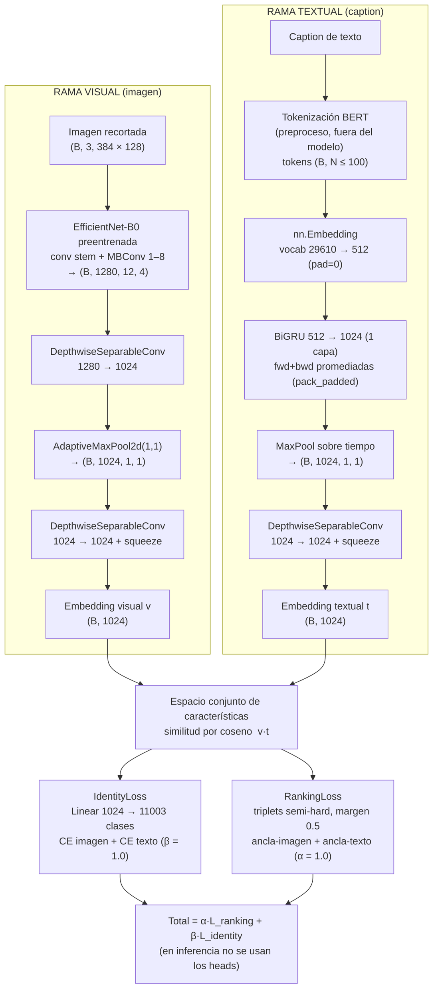

# Arquitectura actual — TextReIDNet (lo que hay en este repo)

Diagrama generado: [`arquitectura_textreidnet.png`](arquitectura_textreidnet.png) / [`arquitectura_textreidnet.svg`](arquitectura_textreidnet.svg)
(equivalentes, para incluir en el paper).

## Diagrama Mermaid (editable)

## Descripción (fiel al código)

### Rama visual (`model/visual_network.py` + `model/textreidnet.py`)
1. Imagen redimensionada a **384×128 (H×W)**, normalizada con mean/std de CUHK-PEDES.
2. **EfficientNet-B0** de torchvision (pesos preentrenados `EfficientNet_B0_Weights.DEFAULT`); se toma la salida del último bloque `features` → `(B, 1280, 12, 4)`.
3. **DepthwiseSeparableConv** `1280 → 1024` (reducción).
4. **AdaptiveMaxPool2d(1,1)** → `(B, 1024, 1, 1)`.
5. **DepthwiseSeparableConv** `1024 → 1024` (feature_length) + `squeeze` → **embedding visual** `(B, 1024)`.

### Rama textual (`model/language_network.py` + `model/textreidnet.py`)
1. El caption se tokeniza con **BERT** en el preprocesado (vocab **29610**, `tokens_length_max=100`, no forma parte del modelo).
2. `nn.Embedding(vocab 29610 → dim 512, padding_idx=0)` + `Dropout(0.30)`.
3. **BiGRU** de 1 capa `512 → 1024` sin bias, entrenada con `pack_padded_sequence`; las direcciones fwd+bwd se **promedian** → `(B, 1024, N, 1)`.
4. **MaxPool sobre el eje temporal** (`torch.max(dim=2)`) → `(B, 1024, 1, 1)`.
5. **DepthwiseSeparableConv** `1024 → 1024` + `squeeze` → **embedding textual** `(B, 1024)`.

### Fusión y pérdidas
- Los embeddings v y t se comparan por **coseno** (`evaluation/evaluations.py`, `evaluation/ranking_loss.py`).
- **IdentityLoss** (`evaluation/identity_loss.py`): Linear `1024 → 11003` (clases de train) aplicada a cada embedding, CrossEntropy en ambas direcciones imagen→etiqueta y texto→etiqueta.
- **RankingLoss** (SRCF-CMPM/CMPC): minería de **triplets semi-hard** bilateral (ancla-imagen y ancla-texto) con **margen 0.5**.
- **Total = α·L_ranking + β·L_identity** con α=β=1.0 (`config.py`).
- En **inferencia** se descartan los heads y se rankea la galería por similitud coseno.

### Datos clave
- ~32.27M de parámetros; EfficientNet-B0 + BiGRU sobre embeddings BERT + DSC (convoluciones separables profundas).
- GPU actual: RTX 4070 SUPER 12 GB; bs16 default, ~10.5 batch/s, VRAM ~4.4 GB.
- Resultado medido (checkpoint época 60, fuente `original`): **Top-1 47.01% / Top-5 70.08% / Top-10 79.08% / mAP 42.41%**.