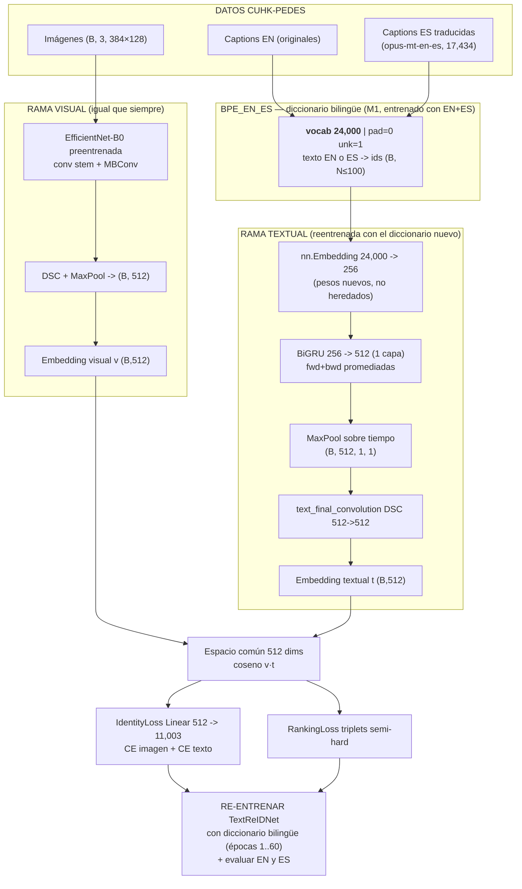

# ARQUITECTURA BILINGÜE (BPE_EN_ES + TextReIDNet)

TextoReIDNet **(Mismo modelo, "boca" nueva)**: la rama visual no cambia
(EfficientNet-B0 preentrenada). Solo la rama textual pasa del tokenizador BERT
a nuestro diccionario bilingüe BPE_EN_ES (24,000 tokens) y se re-entrena.

## Comparación Antes vs Ahora

| Componente | Antes (BERT, solo EN) | Ahora (BPE_EN_ES bilingüe) |
|---|---|---|
| Tokenización texto | BERT (29,610 tokens) | BPE propio (24,000) entrenado con EN+ES |
| `nn.Embedding` | 29,610 → 512 | 24,000 → 256 |
| BiGRU | 512 → 1024 | 256 → 512 |
| Espacio conjunto | 1024 dims | 512 dims |
| Head Identity | Linear 1024 → 11,003 | Linear 512 → 11,003 |
| Rama visual | EfficientNet-B0 → 1024 → 512 | EfficientNet-B0 → 1024 → 512 |
| Idioma | inglés | inglés + español |

## Gráfico: pipeline bilingüe

## Checkpoints (no se pisan entre sí)

- **Baseline (original, BERT, EN, 60 épocas):** `data/checkpoints/`
  - `TextReIDNet_epoch60.pth.tar` / `TextReIDNet_latest.pth.tar`
  - Copia de seguridad: `data/checkpoints/TextReIDNet_baseline_epoch60.pth.tar`
- **Bilingüe (BPE_EN_ES, EN+ES):** `data/checkpoints/bpe24_256x512/`

## Por qué hay que re-entrenar

`nn.Embedding(vocab_size, embedding_dim)` es una tabla de pesos que depende del
vocabulario. Al cambiar BERT (29,610) por BPE_EN_ES (24,000) los pesos no son
transferibles → se re-entrena la rama textual completa (visual sin cambios).